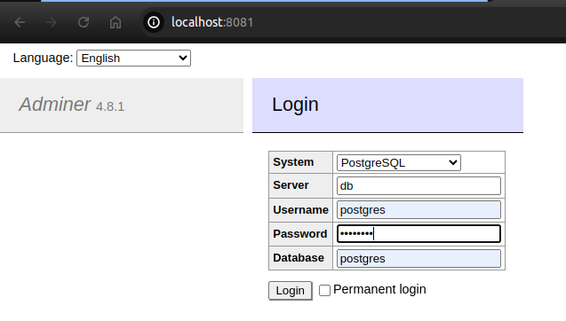

# User Manager

## Build Prerequisites

Ensure you have the following installed:

- Git
- Docker
- Docker Compose (either `docker-compose` or `docker compose`)

## Development Prerequisites

Ensure you have the following installed:

- Git
- Docker
- Docker Compose (either `docker-compose` or `docker compose`)
- Java 21
- Angular

## Getting Started

1. **Clone the Repository:**

```BASH
git clone https://github.com/glimadev07/usermanage-back.git
cd usermanage-back
```

2. **Start the Project:**

```bash
docker compose up --build # or docker-compose up --build
```

## Access the Database

1. With the project started, go to `http://localhost:8081`
2. Select the `PostgreSQL` from the dropdown and login with the database credentials

   > **NOTE**: The database host configured in `docker-compose.yaml` is `db`. Ensure you input `db` in the `Server` field on `Adminer` page.

   


## Access the Front-End

1. With the project started, go to `http://localhost:4200`

